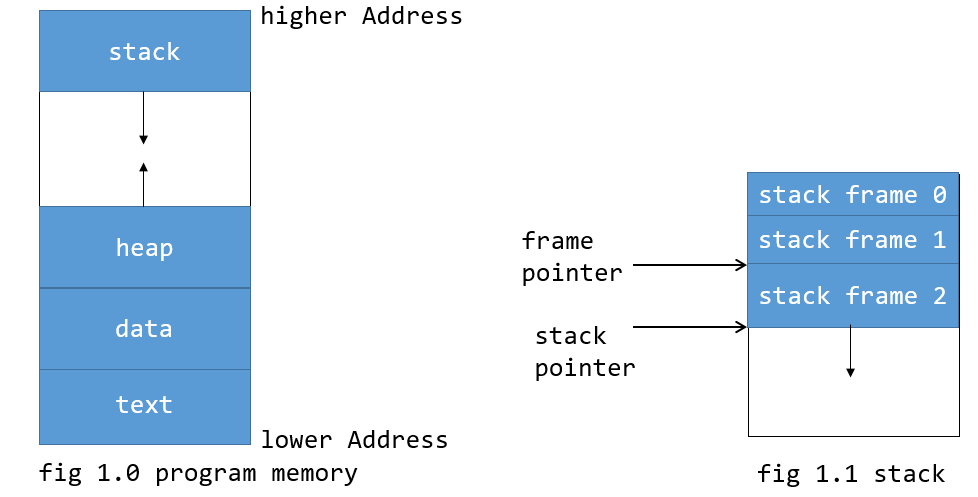

<!-- paginate: true -->

# Debagovanje
## Diana Santavec
diana.santavec@gmail.com
13.08.2022.

---

# Pojam
* Proces pronalaženja i uklanjanja grešaka iz programa

---
# WHY???


---

```c

//...
if (a % 2 == 0){
    printf ("usao u if");
    // ...
}
else {
    printf ("nije usao u if");
    // ...
}
//...

```

---

```c

//...
printf ("i pre %d", i);
for (i = 0;i < 5; i++) {
    niz[i] = i;
    //...
}
printf("i posle %d", i);
//...

```
---
# Kraj?
---

# Metode
* Interaktivno debagovanje
* Analiziranje toka programa
* Testiranja (unit testovi, integracioni testovi)
* Analiza log fajlova
---

# Alati
## `strace`
## `gdb `
## `valgrind`
## `pdb`
---

# Sistemski pozivi
* Interfejs izmedju aplikacije i kernela
* User mode
* Kernel mode - izvršavaju se sistemski pozivi
---

# Sistemski pozivi


---

# Sistemski pozivi
* `open()` - Otvori ili napravi fajl
* `read()` - Pročitaj fajl
* `write()` - Piši u fajl
---

# Sistemski pozivi
* `connect()` - Konektuj se na drugu app/website/etc.
* `futex()` - Zaustavlja program da čeka ispunjenje uslova ili implementira zaključavanje memorije
* `mmap()` - Mapiranje memorije
* `execve()` - Pokretanje programa
---

# `strace()`
* Prikazuje sistemske pozive i signale programa
* Koristan kada nemamo pristup izvornom kodu ili kada program "zamrzne"
* Praćenje procesa koji se izvršava
* Generisanje izveštaja
---

# `strace()`
* Koristi `ptrace()` sistemski proces da se zakači na proces
    * Jedan proces može da prati i kontroliše proces
    * Izmene u memoriji i registrima
    * Breakpoint-i i praćenje sistemskih poziva
* Dovodi do zaustavljanja procesa za svaki sistemski poziv
* Performanse
---

# `strace print`
## Demonstracija
---

# `strace print` - objašnjenje
* `fork()` &rarr; `execve()`
* `brk(NULL)` - traženje heap memorije
* `brk()` - promena *program break*-a (kraj data segmenta za proces) 
---

# `strace print` - objašnjenje
* `arch_prctl()` - postavlja stanje niti za datu arhitekturu
* `mmap()` - pravi novo mapiranje u virtualnom adresnom prostoru pocesa (i za mapiranje fajlova i uređaja i deljenu memoriju)
* `newfstatat()` - vraća informacije o fajlu na koji pokazuje *statbuf*
* `pread()` - cita *n* bajtova iz fajl deskriptora na određenom offset-u u buffer
---

# `strace print` - objašnjenje
* `mprotect()` - menja prava pristupa za određen blok memorije
* `set_tid_address()` - postavlja pokazivač na ID niti
* `set_robust_list()` - postavlja listu *robust futex*-a
    * The purpose of the robust futex list is to ensure that if a thread accidentally fails to unlock a futex before terminating or calling execve(2), another thread that is waiting on that futex is notified that the former owner of the futex has died.

---
# `strace print` - objašnjenje
* `rseq()` - https://lwn.net/Articles/883104/
* `prlimit()` - dobijanje i postavljanje granica za resurse procesa
*   The munmap() function shall remove any mappings for those entire
       pages containing any part of the address space of the process
       starting at addr and continuing for len bytes.
* `getrandom()` -  The getrandom() system call fills the buffer pointed to by buf with up to buflen random bytes.  These bytes can be used to seed user-space random number generators or for cryptographic purposes.
---
# `strace print` - objašnjenje
* `write()` - file descriptor, buffer, velicina
* `exit_group()` - izlazak iz procesa zbog `clone()` poziva
---

# Vežba `strace open_file_
## Zašto dobijamo `Segmentation fault (core dumped)` ?
---

# `strace -e sys_call command`
* Prati samo odabrane sistemske pozive
---

# `strace -o output.txt command`
* Snima ispis u fajl
* Kako ovo možemo drugačije uraditi?
---

# pid
* pid - jedinstveni broj procesa
* `ps`
* `/proc`
* _Demonstacija_
---

# `strace -p pid`
* Služi za praćenje već pokrenutog procesa
---

# `strace -t proc`
* Ispis vremena izvršavanja svakog sistemskog poziva
---
# `strace -r proc`
* Ispis relativnog vremena izvršavanja svakog sistemskog poziva
---

# `strace -c proc`
* Generisanje izveštaja
---

# Praćenje sistemskih poziva sistema
* `/etc/log/syslog`
* systemd
    * `journalctl`
---

# Zaključak
---

# Elf i DWARF
---

# ELF
* Executable and Linking Format
* Format za izvršne fajlove
---

# ELF


---


# Prikaz ELF fajla
* `readelf`
    * 
* `objdump`
    * 
---

# ELF header
* Identifikuje format fajla
* 0x7F 0x45 0x4c 0x46
* 32bitni/64bitni
* little endian/ small endian
* OS na kom je kompajliran
    * Application Binary Interface (ABI)
    * CPU instruction set
---

# Program header table
* Segmenti koji se koriste u toku izvršavanja
---

# .text
* Gde se nalazi kod
---

# .debug
* DWARF
---

# .data
* Globalne tabele i varijable
---

#  `readelf`
* -h - prikaz ELF file header-a
* -l - prikaz program header-a 
* -S - prikaz section header-a
* _Demonstracija_ 
---

# `objdump`
* -f - prikaz file header-a
* -g - prikaz debug informacija
* -d - dissasemble
* -t - prikaz symbol table
* _Demonstracija_
---

# DWARF
* debugging file format
* standard (https://dwarfstd.org/Home.php)
* `.debug_info`
---

# `objdump --dwarf=info`
---

# Kako iskoristiti sada ovo?
---

# Valgrind
* okruženje za pisanje alata za dinamičku analizu programa
---

# `memcheck`
* Prati memorijske bokove koji su alocirani pomocu `malloc`/`new`
* Vidi koji su alocirani i koji su oslobođeni
---

# `memcheck`
* 
* Korišćenje neinicijalizovanih varijabli
* Loše oslobađanje heap memorije
* `memcpy`
---

# `memcheck memory_leak`
## Demonstracija
---

# `memcheck memory_double_free`
## Demonstracija
---

# `callgrind`
* Pravi call-graph pozvanih funkcija
---

# `callgrind`
* callgrind_control
* callgrind_annotate
---

# `callgrind_annotate`
## Demonstracija
---

# `cachegrind`
* Simulira interakcije sa cache memorijom 
* L1,...LL cache memorija
---

# `cachegrind`
* I cache reads (Ir, which equals the number of instructions executed), I1 cache read misses (I1mr) and LL cache instruction read misses (ILmr).

* D cache reads (Dr, which equals the number of memory reads), D1 cache read misses (D1mr), and LL cache data read misses (DLmr).

* D cache writes (Dw, which equals the number of memory writes), D1 cache write misses (D1mw), and LL cache data write misses (DLmw).

* *https://valgrind.org/docs/manual/cg-manual.html*

---
# `cachegrind_annotate`
## Demonstracija
---

# Ali nema grešaka, a ne radi ono što treba...
## Pomoć?
---

# `gdb`
* Omogućava prikaz stanja programa u toku izvršavanja
* Kompajliranje programa sa simbolima za debagovanje
* Radi nad izvršnim programom
---

# `gdb` nastavak
* kretanje liniju po liniju
* prikaz vrednosti promenljivih
* zaustavlajanje izvršavanja programa
* izlisivanje poziva funkcija pre neke funkcije
* etc.
---

# `gcc -g`
* 
---

# `gdb`
* b *broj linije*
* step
* next
* print *varijabla*
* quit
---

# gdb - stack trace
* stack frame
    * "frame" podataka koji postavljamo na stack memoriju
* stack trace
    * "frame" predstavlja pozive funkcija i njegove argumente
---

# Stack Frame


---

# `gdb`
* bt *n*
* info frame
* info args
* info locals
    * up *n*
    * down *n*

---

# `gdb`
## Demonstracija
---

# `gdb` - Debagovanje sa Visual Studio Code
## Demonstracija
---

# Demonstracija
## `main.c`
---

# Ali ja ne koristim C/C++?
---

# Debagovanje - JS
## Demonstracija
---

# Debagovanje - Python
---

# `pdb`
* Modul za interaktivno debagovanje izvornog koda
* Klasa `Pdb`
* Može da se proširuje
* `(Pdb)` - prompt
* Autocomplete sa tabom od verzije 3.3
---

# `pdb` u kodu
## Demonstracija
---

# Python - Debagovanje sa Visual Studio Code-om
## Demonstracija
---

# Hvala na pažnji!
## Pitanja?